# 实验四程序设计说明书

作者：柯劲帆 21281280@bjtu.edu.cn

时间：2022年5月21日
***
**为使程序尽可能人性化，同时满足实验要求，程序设计成两个模式**
- [**用户模式**](#用户模式)：功能相对简洁，不需要用户做过多选择才能实现目的；
- [**开发者模式**](#开发者模式)：功能相对全面，能够满足开发中的部分需求。

由于程序中菜单提示较为充分，进入程序后参照菜单提示选择相应功能即可，如何实现各功能的方法此处不予赘述。

>## 用户模式

用户模式仅实现

1. 选择自动/交互模式
2. 获取数据记录条数和数据记录文件路径
3. 调用实验三生成数据记录文件
4. 询问是否查看生成的数据记录以及储存方法
5. 排序并显示数据记录

如此，可以省去许多不必要的选择，直接生成数据记录文件并查看，或直接查看已有的数据记录文件。

程序流程框图如下图。

>## 开发者模式
开发者模式较用户模式添加了部分开发需要使用的功能

1. 修改配置文件
2. 选择自动/交互模式
3. 获取数据记录条数和数据记录文件路径
4. 调用实验三生成数据记录文件
5. 询问是否查看生成的数据记录以及储存方法
6. 预处理数据集成正序/逆序/乱序
7. 计时排序并显示数据记录以及排序用时，并记入日志

修改配置文件功能可以实现直接在程序内修改配置文件，不需要查找配置文件再在文件内修改。

提供计时排序功能和数据预处理功能，方便比较各种形式的数据集和不同排序方式组合的排序效率。

提供日志功能，将所有计时排序的结果记入日志。

程序流程框图如下图。

